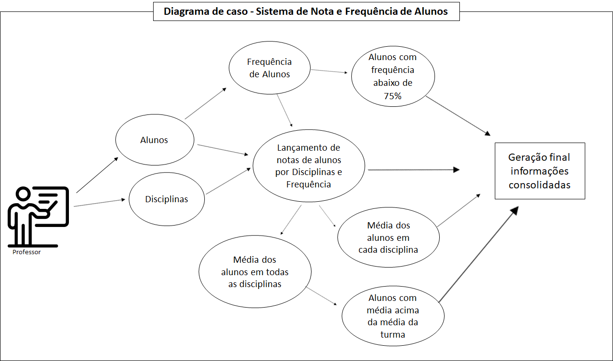

# Sistema de Gerenciamento de Notas - Gestor Acadêmico - Backend

* Framewok Flask
* Python
* Hopedado no Render

O front-end desse projeto encontra-se em: https://github.com/AlexadraCampos/sistema_de_gerenciamento_de_notas_front

## Diagrama do Sistema:

# Projeto

O Sistema de Nota e Frequência de Alunos foi desenvolvido para apoiar o professor Carlos no controle dos estudantes em disciplinas, com base em notas e frequência.
Sobre o sistema:
*	Alunos com frequência abaixo de 75%
*	Lançamento de notas dos alunos
*	Média dos alunos por disciplina
*	Média geral dos alunos
*	Alunos com média acima da média da turma

### Melhorias Futuras
	Emitir relatórios em pdf, incluir sistema de matricula, histórico de desempenho do aluno por semestre
